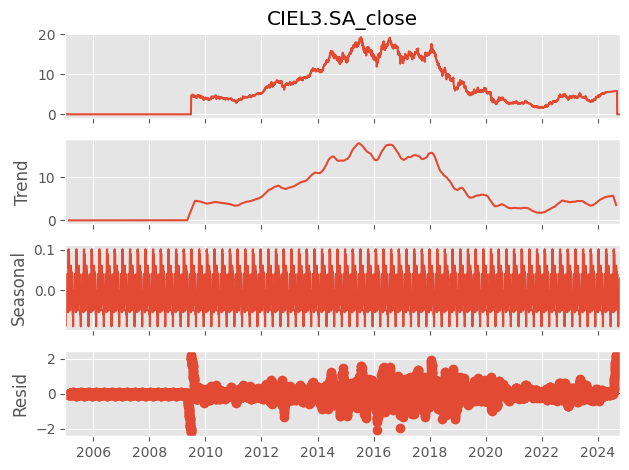
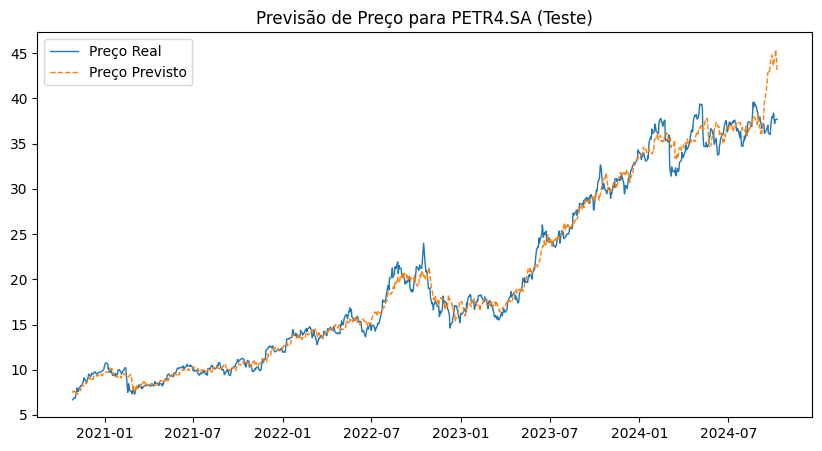
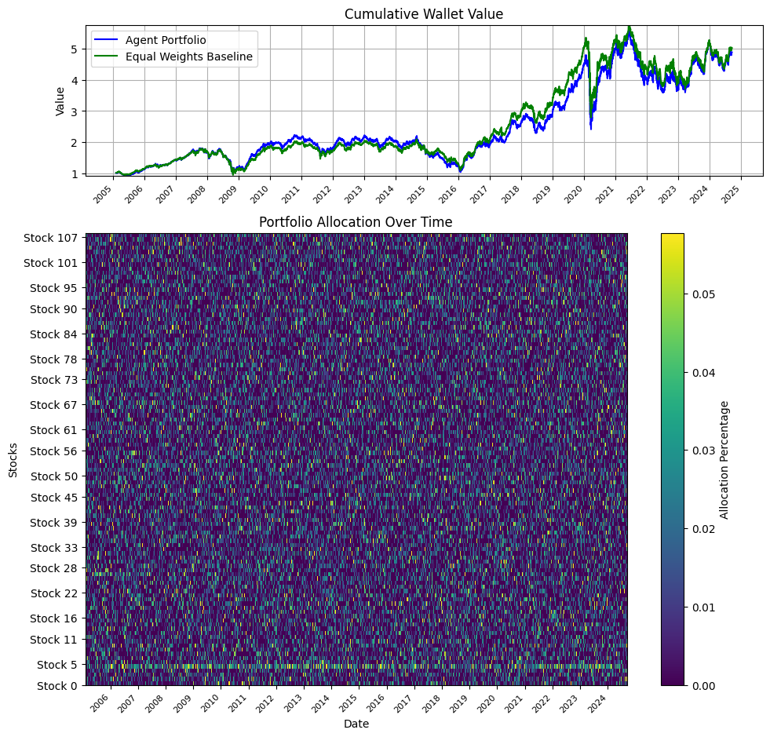

# Reinforcement learning for Brazilian Stock Trading

run `src/download_data.py` to fill the datasets with stock market value, Selic and IPCA.

run `src/clean_data.py` to produce the cleaned variational data for agent interaction:

`descriptive&regression.ipynb` explore the collected data and helps understand and debug the system



`descriptive&regression.ipynb` also defines linear regression models to the stock data, helping understand if it's possible to predict stock time-series with past data.



for the agent, first we clean variational data of the stocks to be used as states:

for each stock $i$ at day $j$,
```math
var_{i,j} = (\text{price}_{i,j} - \text{price}_{i,j-1} + \text{dividend}_{i,j}) / (1 + \text{ipca\_daily}_{j})
```

such variational data constituite a tabular dataset which is used to compose the environment:
at day $j$, with $n$ stocks and $k$ rollling window:
```math
state_{j} =
\begin{bmatrix}
var_{1,j} & var_{2,j} & \cdots & var_{n,j} \\
var_{1,j-1} & var_{2,j-1} & \cdots & var_{2,j-1} \\
\vdots & \vdots & \ddots & \vdots \\
var_{1,j-k} & var_{2,j-k} & \cdots & var_{n,j-k}
\end{bmatrix}
```
therefore, the state $j$ constitute of the last $k$ days of all stocks.

action constitute of a stochastic vector of size $n$, representing the percentage of portifolio allocated in each stock.

reward is defined as the dot product between the action and the next variation.

`main.py` train an actor-critic reinforcement learning agent with the specified state, action and reward definitions.



